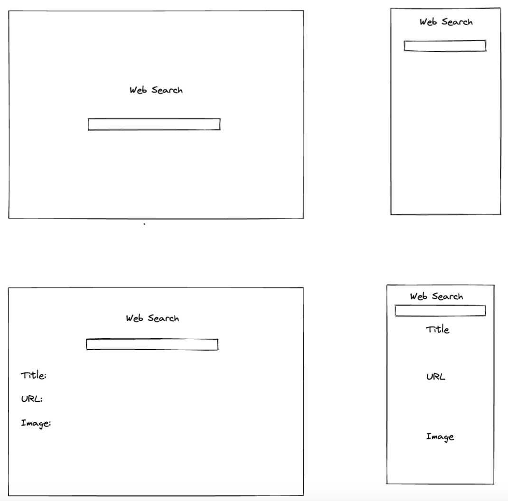

# Web search

This project allows to do a web search.
https://rapidapi.com/contextualwebsearch/api/web-search/details
### Technologies Used

- Javascript
- CSS
- Ajax
- JQuery
- HTLM
- Web search API

### Wireframes

### Daily Plan

| Day | Goal |
|-----|------|
| 0 | Choose API |
| 1 | Render data to console|
| 2 | Render data to screen|
| 3 | Add DOM componets|
| 4 | Add CSS |
| 5 | Optimize code |
| 6 | Testing program search|
| 7 | Turn in project one|
### Link to Project
[My Project Live Page](https://www.manuelportocarrero.com/) create a form

